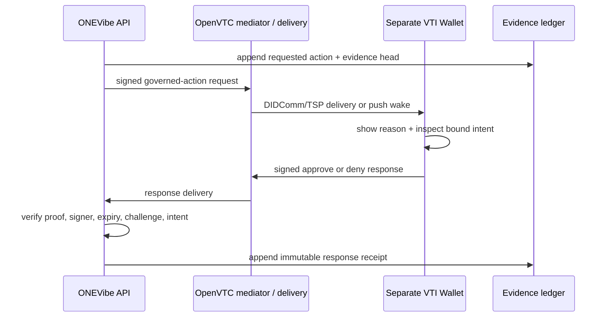

# OpenVTC approval integration contract

## Status

**Design contract — not yet a production transport.** ONEVibe currently has an evidence-bound local adapter so the task lifecycle and browser boundary can be tested. It must be replaced by a separately deployed OpenVTC wallet/VTA path before an approval is treated as cryptographic authority.

## What the local OpenVTC sources establish

- The iOS `vta-mobile-agent-ios` app is a separate approver with push wake-up, device/passkey custody, and a signed approval-or-denial response path.
- OpenVTC Trust Tasks define `auth/step-up/approve-request` and `approve-response` for **session-assurance elevation**. They bind a random challenge, subject, session, expiry, human-readable reason, and cryptographic gate.
- An approval response must be correlated to a pending request, reject expiry/replay, verify its proof or WebAuthn assertion, and authorize the named approver. A valid signature alone is not sufficient.

## Important non-goal

Do **not** represent “publish this artifact”, “share this data”, or “use this connector” as an `auth/step-up` request unless it genuinely elevates a session under that specification. Reusing that type merely for an approval-shaped UI would create a protocol-semantic bug.

ONEVibe needs a dedicated governed-action Trust Task type, or a formally approved OpenVTC/VTA policy that maps an action approval to a session step-up and then enforces the action server-side. Until one exists, the local adapter remains explicitly non-production.

## Required approval request semantics

A future `governed-action/approve-request` document must be signed by the ONEVibe relying-party identity and include, in its signed payload or extension:

| Field | Requirement |
|---|---|
| Request ID | Unique and single-use; becomes the response correlation/thread ID. |
| Task ID | The ONEVibe task requesting the action. |
| Action | Narrow verb such as `share_artifact` or `publish_preview`; never an open-ended command. |
| Intent hash | SHA-256 of request ID, task ID, action, expiry, and evidence head. |
| Evidence head | Immutable task ledger hash at the time the action was requested. |
| Reason | Plain-language summary shown verbatim to the approver. |
| Expiry / challenge | Short-lived, server-bound, high-entropy anti-replay material. |
| Recipient / approver policy | The specific approver DID or a server-resolved policy expression. |

The existing ONEVibe `intentHash` is intentionally a transport-neutral starting point for this payload. It does not itself prove user consent.

## Required response verification

The ONEVibe API—not the browser—must accept a response only after it:

1. resolves to an unconsumed, unexpired pending request;
2. matches the request ID/thread and constant-time challenge;
3. matches the exact action, task ID, intent hash, and evidence head;
4. verifies the OpenVTC proof or the configured WebAuthn gate;
5. resolves and authorizes the signer as the bound or policy-eligible approver;
6. atomically consumes the request, records the signed response/hash in evidence, and performs the narrowly approved server-side action.

A denial must be recorded and consume the request too. The browser and agent may request an approval and display its status; neither may sign, verify as authoritative, mint, replay, or substitute a decision.

## Delivery model

Deep links may help a wallet discover a pending task, but are not a delivery guarantee and are never evidence of an approval.

## Integration prerequisites

1. A dedicated Trust Task schema/policy decision for governed actions.
2. ONEVibe relying-party DID and signing capability held outside the browser.
3. Registered user/manager approver DIDs and authorization policy.
4. Mediator/TSP or DIDComm delivery configuration, including push wake where required.
5. A verifier backed by OpenVTC DID resolution and Data Integrity/WebAuthn validation.
6. End-to-end replay, wrong-signer, wrong-intent, expiry, denial, and lost-device tests.

## Acceptance proof

Production credit requires a real wallet device to receive a request, show the human-readable action and evidence binding, return a signed approval and a signed denial, and have ONEVibe accept only the valid matching result. A local CLI/HMAC path is useful for UI and lifecycle testing but cannot satisfy this gate.
