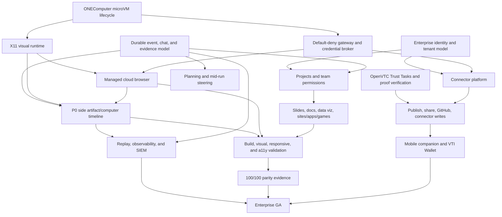

# ONEVibe / ONEComputer product roadmap

**Horizon:** 12 months from roadmap approval

**Baseline:** 2026-07-15

**Owners:** VP Product (outcomes), VP Engineering (delivery), Security lead (promotion authority)
**Source of truth:** This roadmap sets sequencing and gates; [`MANUS-PARITY.md`](MANUS-PARITY.md) remains the line-item implementation ledger.

## Product north star

ONEVibe is the governed AI work platform where a person or team can delegate an outcome, watch and steer the work, and receive a production-ready artifact with verifiable provenance—at Manus-level breadth and quality, with stronger enterprise isolation, identity, policy, approval, and evidence.

**North-star metric:** weekly verified outcomes (WVO): distinct weekly active users who complete at least one task that produces an opened, exported, published, or connected-system artifact and whose evidence chain verifies. Track WVO per activated organization and by task mode; never count demo fixtures, failed validations, or artifacts the user does not consume.

The 12-month objective is **1:1 behavioral parity across all 100 ledger items**, not visual resemblance. Every item must be `I`, have automated or rendered evidence, run on the production enforcement path where security-sensitive, and pass the acceptance gates below. Target outcomes:

- ≥40% of activated organizations produce WVO in four of their first six weeks.
- ≥60% task success without a restart; ≥75% after one user intervention.
- ≥30% of weekly outcomes use reusable project context or an approved connector.
- ≥25% of completed creation tasks are shared, exported, handed to GitHub/cloud drive, or published.
- 100% of non-demo execution uses an attested ONEComputer boundary; 100% of sensitive actions carry a valid policy decision and, when required, external wallet proof.
- Enterprise launch has zero open critical/high security findings and meets the SLOs in this document.

## Personas and jobs to be done

| Persona | Primary job | Required experience | Success signal |
|---|---|---|---|
| Individual maker / founder | Turn a brief into a polished deck, report, site, app, visualization, or game | Useful first draft in one session; inspect, edit, preview, export, publish | First verified outcome <30 minutes; repeat use within 7 days |
| Knowledge worker / analyst | Research connected sources and produce defensible documents, reports, and data stories | Citations, source lineage, charts, document/PDF/Slides output, reusable context | ≥90% citation validity; output accepted without full rewrite |
| Product, design, and engineering team | Build and iterate working websites/apps/games and hand off source | Browser testing, code workspace, generated stack, GitHub workflow, project memory | Validated build and handoff; median follow-up rework ≤2 turns |
| Executive / approver | Review consequential actions quickly and safely | Plain-language impact, exact scope, expiry, mobile wallet decision, immutable receipt | Approval completion p95 <5 minutes; no browser-authorized decisions |
| IT / security / compliance admin | Deploy AI work without losing control of identities, data, or egress | SSO/SCIM, RBAC, tenant isolation, policies, audit/SIEM, retention, regional controls | Policy coverage 100%; evidence export verifies; audit retrieval <5 minutes |
| Platform / connector developer | Add runtimes, tools, connectors, and templates without weakening controls | Versioned SDK/contracts, test harness, capability scopes, reviewable registry | New vetted integration in ≤5 engineer-days |

## Product pillars

1. **Delegate and steer:** durable tasks, agent-generated plans, mid-run steering, waiting states, chat history, projects, context, and transparent progress.
2. **Create anything useful:** first-class Slides; documents/reports; data visualization; websites, apps, and games; editable source; templates; multi-format delivery.
3. **See, scrub, and verify the work:** a Manus-style side artifact/computer timeline automatically presents terminal, screenshot, browser, file, diff, slide, and preview activity as it happens, then lets users replay any immutable evidence-backed moment. This is a P0 differentiator, not a secondary activity log.
4. **Secure computer for every task:** ONEComputer microVM isolation, X11 visual runtime, default-deny gateway, scoped credentials, lifecycle controls, and measurable runtime SLOs.
5. **Governed action everywhere:** OpenVTC Trust Tasks, independent mobile/VTI Wallet approval, least-privilege connectors, policy composition, and externally anchored evidence.
6. **One workspace across contexts:** responsive dark/light UX, durable searchable chat, reusable projects, local/cloud computers, web and mobile continuity, sharing, and collaboration.

## Roadmap principles and non-negotiable gates

- Ship vertical outcomes, not disconnected surfaces. A creation mode includes generation, editing, validation, provenance, export, and reuse.
- Browser and agent are untrusted. They may request an action but never mint approval, access ambient credentials, or bypass the gateway.
- Security-sensitive parity is credited only on real ONEComputer/OpenVTC paths. Simulators remain explicitly labelled.
- One ordered durable event stream underpins UI state, history, audit, replay, and exports; provider-native events are retained safely.
- Default-deny egress, ephemeral workspaces, broker-custodied credentials, tenant isolation, and secret redaction are release blockers.
- Accessibility, responsive behavior, dark/light themes, observability, cost limits, and deletion are definition-of-done—not cleanup work.

## Phased plan

### Phase 1 — Foundation to trustworthy daily use (0–3 months)

**Outcome:** close core interaction gaps and make every internal/beta task run inside a measurable production-like trust boundary.

| Release train | Product scope | Exit evidence |
|---|---|---|
| R1.1 Core loop (weeks 1–4) | Agent-generated plans, per-step elapsed time, run reset semantics, true mid-run steering, local-folder/reference inputs, prompt safety, syntax highlighting; dark/light/system theme; responsive/mobile-web polish; preserve searchable chat history | Reload/cancel/resume/steer E2E; WCAG scan; desktop/mobile visual matrix; ledger 3–5, 7, 16–20, 26, 28, 57, 63 |
| **R1.1 P0 Side timeline (weeks 1–6)** | Versioned typed presentation-event contract; server-derived automatic panels for terminal, screenshot, browser, file, diff, slide, and preview events; live-follow mode with clear pause/resume and new-activity affordance; keyboard-accessible backward/forward stepping and time scrub; each panel bound to task, run, sequence, timestamp, artifact version, and evidence hash | Contract/schema tests across every panel type; reconnect/order/idempotency E2E; live-follow and scrub interaction tests; 10,000-event task opens p95 <2s and scrub response p95 <100ms on reference hardware; 100% rendered panels resolve to verifying evidence; no mutable historical panel |
| R1.2 Secure computer (weeks 3–8) | ONEComputer microVM lifecycle, resource quotas, snapshot/restore contract, X11 visual runtime stream, clipboard/file-transfer policy, default-deny Rust gateway, short-lived credential broker, isolated preview origins | Cross-tenant and escape tests; egress-denial proof; X11 interaction recording; sandbox create/destroy/load tests; ledger 18–21, 84, 93–94 security path |
| R1.3 Creation quality (weeks 5–10) | Slides template import/catalogue, thumbnails/editable notes, PDF export; documents/reports with citations; data ingestion and interactive visualization; generated website/app/game builds with browser, responsive, a11y, and screenshot review | Golden-task suite and rendered-artifact review; PPTX/PDF/doc/data/source round trips; ledger 29–32, 42–44, 71–81, 91–93, 98–99 |
| R1.4 Governed beta (weeks 8–12) | Enterprise identity baseline (OIDC/SAML, RBAC, tenant isolation), OpenVTC Trust Task adapter, asymmetric VTI Wallet proof verification, externally anchored evidence, retention/deletion controls, SIEM export | Threat model signed; authz matrix; proof replay/tamper tests; tenant isolation test; evidence verification; SECURITY promotion gates 1–7 |

**Phase acceptance gate:** all P0 core-loop, side-timeline, and boundary tests pass for 14 consecutive days; no critical/high findings; ≥95% golden tasks complete; production-like non-demo runs have attested microVM + gateway; wallet proof is externally verifiable; beta design partners achieve ≥25% four-week WVO retention. The side timeline must render every supported event automatically, preserve immutable replay across reload/reconnect, meet its p95 performance targets, and retain complete hot history for at least 30 days. Failure holds external beta.

### Phase 2 — Connected team workflows (3–6 months)

**Outcome:** turn isolated tasks into reusable, connected projects that teams can safely operate.

| Release train | Product scope | Exit evidence |
|---|---|---|
| R2.1 Projects and memory (months 3–4) | Project hierarchy, reusable instructions/files/facts, context versioning, task-to-project moves, context indicators, permissions, archive/export/delete; Dashboard/Database/Settings workspace tabs | Context provenance and stale-context UX; project ACL tests; ledger 15, 22, 66–69, 97 |
| R2.2 Connector platform (months 3–5) | Capability-scoped connector SDK/registry; GitHub, Gmail, Figma, cloud-drive and website-reference connectors; OAuth broker; admin allowlist; read/write scopes; secret rotation; governed GitHub handoff | Connector contract tests, revocation <5 min, data-lineage evidence, GitHub PR E2E; ledger 23–26, 88, 94–95, 98 |
| R2.3 Cloud browser and computers (months 4–5) | Managed browser sessions inside microVM/X11, authenticated site interaction, DOM/screenshot/download capture, browser replay, local/cloud computer inventory and lifecycle, human takeover | Browser benchmark pass ≥90%; session isolation; credential non-exposure; ledger 18–21, 93 |
| **R2.3 P0 Timeline scale (months 3–6)** | Unified cross-run/project timeline; thumbnail virtualization and progressive media loading; snapshot/diff deduplication; filters and jump-to-evidence; synchronized X11/browser playback; share/export permissions; hot/warm/cold retention tiers and tenant policy | 100,000-event project opens p95 <3s, scroll holds ≥55 fps at p95, panel switch p95 <150ms; zero ordering drift in chaos/reconnect tests; 90-day hot history and policy-controlled warm/cold retrieval; legal hold and deletion verified |
| R2.4 Creation breadth (months 4–6) | Production documents/reports, chart builder and narrative data visualization, generated assets proxy, component/Tailwind/server/shared-code/package-lock scaffolds, playable game loop, role journeys, catalogue/templates, generated brand artwork | Cross-format fidelity suite; generated-project install/build/test; asset provenance; ledger 33–60, 73–77, 80–82, 87, 89–92 |
| R2.5 Team governance (months 5–6) | SCIM, groups, project roles, policy bundles, legal hold/retention, audit search/export, admin analytics, budgets, DLP hooks, regional deployment controls | Enterprise readiness review; SCIM lifecycle E2E; audit completeness and deletion attestations |

**Phase acceptance gate:** ≥3 design partners use projects weekly; ≥30% WVO uses project context/connectors; connector success ≥99%; revocation enforced within 5 minutes; browser benchmark ≥90%; generated project validation ≥95%; SOC 2 control evidence package review has no material gap. Failure limits rollout to controlled beta.

### Phase 3 — 1:1 parity and enterprise GA (6–12 months)

**Outcome:** achieve evidence-backed Manus parity, enterprise operational maturity, and cross-device governed action.

| Release train | Product scope | Exit evidence |
|---|---|---|
| R3.1 Mobile and Wallet (months 6–8) | iOS/Android companion for task/chat/history, artifact review, push, deep links, passkey/device binding; production VTI Wallet approval and receipt portability; responsive web parity | Device/browser matrix; lost-device/replay tests; approval p95; ledger 85, 100 |
| R3.2 Quality and collaboration (months 7–9) | Comments, mentions, shared project roles, branch/version comparison, richer artifact reuse, live co-presence where justified; observability collector and user-visible diagnostics | Collaboration conflict tests; support diagnosis <15 min; ledger 88, 97 |
| **R3.2 P0 Timeline intelligence (months 6–10)** | Mobile review, collaborative deep links/comments anchored to immutable moments, semantic chapters and search, compare-runs, exportable replay manifest, admin retention controls, SIEM linkage, and assistive-tech parity | 1,000,000-event cold-history search p95 <5s; evidence/deep links survive export and restore; retention/deletion/legal-hold matrix passes; WCAG 2.2 AA external audit; ≥60% of weekly task viewers use a panel and ≥25% scrub/revisit history |
| R3.3 Scale and compliance (months 8–10) | Multi-region control/data planes, disaster recovery, customer-managed keys, private networking, residency, audit/SIEM integrations, penetration test, accessibility conformance report | DR exercise; restore objectives met; pen test clean; WCAG 2.2 AA conformance; procurement package |
| R3.4 Parity closure (months 9–11) | Close every residual M/P item, exact behavior comparison, visual/interaction quality pass, migration/import/export polish, cost and latency optimization | 100/100 ledger rows `I`; evidence link per row; parity benchmark signed by Product, Eng, Security, Design |
| R3.5 Enterprise GA (months 11–12) | SLA/support operations, admin onboarding, billing/quotas, status page, incident process, compatibility guarantees, GA migration | 30-day SLO burn healthy; launch review; three enterprise references; no P0/P1 launch blockers |

**GA acceptance gate:** 100/100 parity rows are `I`; all security promotion gates pass; ≥99.9% control-plane availability over 30 days; no critical/high vulnerabilities; restore and incident exercises pass; ≥40% activated-org WVO retention; three enterprise customers complete security review and production deployment. No “Manus parity” or “enterprise secure” claim before this gate.

## Release trains and operating rhythm

- One two-week engineering increment; releasable trunk at all times behind server-enforced flags.
- Monthly train promotion: development → internal → design partner → beta → GA. Security boundary changes require a separate attestation before promotion.
- Quarterly outcome review may reorder R2/R3 scope but cannot waive security, evidence, parity, accessibility, or reliability gates.
- Every train includes migration/rollback, telemetry, runbook, support notes, threat-model delta, and an updated parity ledger.
- Compatibility policy: additive API/event changes in minor versions; breaking changes require versioned adapters and one-train migration overlap.

## Dependency graph

**Critical path:** tenant identity → microVM/gateway → OpenVTC proof → connectors/browser → artifact validation → parity evidence → enterprise GA. Parallelizable streams are creation modes, UX themes/history, and mobile foundations, but none may bypass the critical-path controls.

## KPIs and SLOs

| Area | Metric | 3-month target | 6-month target | GA target |
|---|---|---:|---:|---:|
| North star | WVO / weekly active user | 0.6 | 1.0 | 1.5 |
| Activation | First verified outcome within 24h | 35% | 50% | 60% |
| Retention | Activated orgs with WVO in 4 of 6 weeks | 25% beta | 35% | ≥40% |
| Task quality | Success without restart / after one intervention | 50% / 65% | 55% / 70% | ≥60% / ≥75% |
| Creation quality | Golden tasks passing artifact rubric | ≥95% core set | ≥95% broad set | ≥98% |
| Runtime | Task start p95 / warm interaction p95 | <20s / <3s | <15s / <2.5s | <10s / <2s |
| Reliability | Control-plane availability | 99.5% beta | 99.9% | ≥99.9% monthly |
| Streaming | Durable event delivery | 99.9% | 99.95% | ≥99.99%; no acknowledged-event loss |
| Side timeline | Panel availability / evidence resolution | ≥99.9% / 100% | ≥99.95% / 100% | ≥99.99% / 100% |
| Side timeline | Initial open / scrub-panel response p95 | <2s / <100ms at 10k events | <3s at 100k / <150ms | <3s hot, <5s cold / <150ms |
| Side timeline | Rendering smoothness / ordering correctness | ≥55 fps p95 / 100% | ≥55 fps p95 / 100% | ≥55 fps p95 / 100% |
| Side timeline | History retention | ≥30 days hot | ≥90 days hot + policy tiers | Tenant policy, legal hold, export, and deletion all verified |
| Side timeline | Viewer engagement / historical scrub | Baseline | ≥50% / ≥20% | ≥60% / ≥25% |
| Sandbox | Successful provision / guaranteed destruction | 99% / 99.99% | 99.5% / 100% | ≥99.9% / 100%, p99 destroy <5m |
| Browser | Benchmark task completion | 80% | ≥90% | ≥95% |
| Connectors | Successful authorized calls / revocation | — | ≥99% / <5m | ≥99.9% / <1m p95 |
| Approval | Wallet delivery / decision round trip | 99% / p95 <5m | 99.9% / p95 <3m | ≥99.9% / p95 <2m excluding user think time |
| Security | Sensitive action with policy + required proof | 100% | 100% | 100%; zero bypasses |
| Evidence | Verifiable terminal chains / SIEM lag | 100% / <10m | 100% / <5m | 100% / <60s p95 |
| Accessibility | Critical flows meeting WCAG 2.2 AA | 90% | 100% | 100% plus external audit |
| Cost | Gross runtime cost per successful outcome | Baseline | -20% | -35% vs baseline without quality regression |

SLOs use rolling 30-day windows and error-budget policy: at 50% burn freeze discretionary launches; at 100% burn freeze all non-reliability releases until recovery and corrective review. Security/evidence correctness has no error budget.

## Explicit acceptance gates

Every feature is accepted only when all applicable gates pass:

1. **Outcome:** named persona completes the job in an E2E test; instrumentation shows activation, completion, and consumption.
2. **Behavioral parity:** observed behavior matches the corresponding `MANUS-PARITY.md` row; edge cases and interaction quality are documented.
3. **Artifact quality:** output opens in target tools, preserves structure and provenance, passes mode-specific rubric, and remains portable.
4. **Security:** authn/authz, tenant isolation, least privilege, default-deny egress, secret handling, external approval, abuse limits, and threat-model tests pass.
5. **Evidence:** every state change is ordered, append-only, secret-free, externally verifiable where required, and exportable.
6. **Reliability:** load, cancellation, retry/idempotency, timeout, cleanup, disaster, and rollback paths meet SLO.
7. **UX:** desktop/mobile and dark/light/system themes pass visual review; keyboard, screen-reader, reduced-motion, contrast, empty/error/loading states meet WCAG 2.2 AA.
8. **Operations:** dashboards, alerts, cost guardrails, runbooks, support diagnostics, migration, deletion, and ownership exist.
9. **Production proof:** no security-sensitive feature advances beyond preview based only on demo/local/simulated evidence.
10. **P0 side timeline:** all seven automatic panel classes render from typed server events without frontend inference; live follow never steals position after the user pauses; backward/forward and scrub restore the exact immutable artifact/computer state; evidence links verify; reconnects introduce no gaps, duplicates, or reordering; performance and retention SLOs pass at target scale.

## Build-versus-buy decisions

| Capability | Decision | Rationale / guardrail | Revisit trigger |
|---|---|---|---|
| Task UX, event model, projects, artifact workspace | **Build** | Core differentiation and parity surface; keep provider-neutral contracts | Never outsource product control plane |
| ONEComputer microVM/X11/gateway | **Integrate and co-develop** | Existing security boundary is strategic; ONEVibe owns versioned adapter and SLO | Build alternative only if isolation/SLO contract fails two quarters |
| OpenVTC/VTI Wallet, DID/proof cryptography | **Buy/integrate** | Never invent crypto/key custody; use vetted packages/services | Provider fails independent audit or portability requirements |
| Foundation models/agent runtimes | **Multi-vendor buy** | Avoid model lock-in; route by quality/cost/data policy | In-house model only for proven economics or residency need |
| Identity (OIDC/SAML/SCIM) | **Buy protocol implementation** | Commodity, security-sensitive; retain internal RBAC/policy model | Enterprise requirements exceed vendor portability |
| Browser automation engine | **Buy/use standards; build orchestration** | Use Chromium/Playwright-class engine; own governed session/evidence layer | Engine cannot meet isolation/accessibility needs |
| Office/PDF rendering | **Buy/open-source libraries; build QA pipeline** | File fidelity is specialized; retain deterministic converters and golden tests | Licensing, fidelity, or server isolation fails |
| Connector framework | **Build broker/SDK; buy connector implementations selectively** | Policy, credentials, evidence are core; commodity APIs can be sourced | Top connector cannot meet scope/revocation/data terms |
| Telemetry/SIEM/error tracking | **Buy backend; build privacy schema and adapters** | Commodity storage/query; evidence model and redaction remain ours | Cost/residency or export lock-in breaches targets |
| Mobile apps | **Build thin companion; integrate OS security** | Task continuity and wallet UX are differentiated; use passkeys/push primitives | Fully native cost exceeds adoption after two quarters |

## Team and workstream ownership

| Workstream | Accountable owner | Initial staffing | Scope |
|---|---|---:|---|
| Product core | Director PM + Eng manager | 1 PM, 1 design, 5 eng | Tasks, plans, steering, chat history, projects, collaboration, dark/light UX |
| Creation studio | Group PM + Eng manager | 1 PM, 2 design, 7 eng | Slides, docs/reports, data viz, sites/apps/games, templates, artifact QA |
| Secure runtime | Principal engineer | 6 systems/security eng | ONEComputer microVM, X11, browser, gateway, credentials, lifecycle and SLOs |
| Trust and enterprise | Security lead + Enterprise PM | 1 PM, 5 eng, 2 security | Identity, RBAC, OpenVTC/Wallet, policy, audit, compliance, admin |
| Integrations | Eng manager | 1 PM shared, 5 eng | Connector SDK, GitHub/Gmail/Figma/drive, computer inventory, developer platform |
| Mobile | Mobile lead | 1 design shared, 4 eng | iOS/Android companion, notifications, device binding, wallet handoff |
| Quality/platform | Staff SRE | 3 SRE/QA, embedded champions | Golden tasks, E2E, performance, observability, release engineering, DR |

Security and accessibility embed reviewers in every stream and retain veto authority at promotion gates. Product owns outcome and parity sign-off; Engineering owns operability; Security owns boundary attestation; Design owns interaction/fidelity; SRE owns SLO evidence. If staffing is below 30–35 dedicated people, preserve the critical path and move collaboration/breadth—not security or validation—out of horizon.

## Decision and review cadence

- **Daily:** automated quality/SLO/security signal review by on-call; incident command for breached hard gates.
- **Weekly:** workstream delivery review against outcome, dependency, risk, and acceptance evidence; parity ledger updated in the same change as implementation.
- **Biweekly:** demo real production paths and golden tasks; architecture/security review for contract or trust-boundary changes.
- **Monthly:** release council (Product, Eng, Security, Design, SRE, Support) decides promotion, holds, or rollback using gates and error budget.
- **Quarterly:** strategy and portfolio review with customer evidence, WVO cohorts, unit economics, roadmap reallocation, and build-vs-buy reassessment.
- **Decision records:** irreversible or cross-boundary choices require an ADR with owner, options, evidence, expiry/revisit trigger, and dissent. The DRI decides after consultation; Security decides security acceptance.

## Risk register

| Risk | Likelihood / impact | Leading indicator | Mitigation | Owner |
|---|---|---|---|---|
| Cosmetic parity outruns behavioral quality | M / H | Ledger moves without E2E/artifact evidence | Per-row evidence links, golden tasks, external comparison review | Product core PM |
| Sandbox or X11 escape / cross-tenant leak | L / Critical | Isolation test anomaly, unexpected host access | Defense in depth, ephemeral microVMs, patch SLA, red team, kill switch | Secure runtime lead |
| Gateway bypass or credential exfiltration | M / Critical | Direct egress, secret in workspace/event | Network attestation, brokered short-lived creds, canaries, secret scanning | Security lead |
| Browser automation fragility/CAPTCHA | H / H | Benchmark decline, takeover rate | DOM+vision fallback, human takeover, site policies, no anti-abuse circumvention | Browser lead |
| Side-timeline media volume degrades latency or cost | H / H | p95 open/scrub regression, storage per task rises | Content-addressed deduplication, thumbnails, progressive fetch, tiered retention, per-tenant quotas | Product core + SRE |
| Timeline presentation diverges from evidence | M / Critical | Missing/misordered panel or hash mismatch | Server-owned typed events, sequence/idempotency keys, immutable manifests, continuous reconciliation | Product core lead |
| OpenVTC/mobile approval latency blocks work | M / H | Expired requests, abandonment | Push/deep links, clear scope, asynchronous resume, alternate registered device | Trust PM |
| Connector scope creep and provider churn | H / M | API breakage, auth failures | Versioned SDK, top-five focus, contract tests, kill/revoke switches | Integrations lead |
| Artifact fidelity disappoints users | M / H | Export-open failures, heavy manual rewrites | Golden corpora, native-format validation, rendered diffs, expert review | Creation PM |
| Project memory leaks/stales context | M / H | Wrong-project citations, stale facts | Explicit provenance/version/expiry, ACL inheritance tests, user-visible context | Product core lead |
| Model vendor quality/cost volatility | H / M | Cost/WVO or regression score worsens | Provider-neutral runtime, eval-based routing, budgets, caching | Platform architect |
| Evidence volume/privacy conflict | M / H | Sensitive payload finding, cost spike | Data minimization, field allowlists, redaction, tiered retention, customer controls | Security + SRE |
| Mobile surface increases attack area | M / H | Device replay/lost-device incidents | Device binding, passkeys, remote revoke, minimal local data | Mobile lead |
| Scope exceeds staffing and misses critical path | H / H | Dependency aging, WIP > limits | Fund 30–35 FTE plan; cap concurrent trains; cut breadth before controls | VP Product/Eng |
| Enterprise compliance delays GA | M / H | Control evidence gaps at month 6 | Start evidence collection in R1.4; external readiness review; named control owners | Enterprise PM |
| Availability failure during long tasks | M / H | orphan runs, event gaps | Durable queues/checkpoints, idempotency, reconciliation, regional DR | SRE lead |

## Mapping to `MANUS-PARITY.md`

The ledger is updated row-by-row; this roadmap groups ownership and target train. “Maintain” means already implemented behavior must remain green while deeper production gates are added.

| Ledger rows | Capability | Target train | Completion interpretation |
|---|---|---|---|
| 1–14 | Task/agent loop, planning, steering, timing, waiting, routes, history | R1.1 + P0 side timeline; maintain 1–2, 6, 8–14 | Rows 3–5 and 7 close with agent plans, elapsed time, reset, and mid-run steering; rows 4, 6, and 12 gain synchronized visual work replay |
| 15–28 | Projects, context/input, computers, connectors, safety | R1.1, R2.1–R2.3 | Projects/context indicators + governed local/cloud inputs + GitHub/Gmail/Figma/reference inputs |
| 29–44 | Modes, templates, Slides | R1.3, R2.4 | Native, editable, validated outputs; catalogue/import; no static mock qualification |
| 45–60 | Ideation, generated design, responsive/theme system | R1.1, R2.4 | Agent-generated candidates/assets/copy; dark/light and generated responsive design evidenced |
| 61–70 | Embedded workspace | R1.1, R2.1, P0 side timeline | Syntax highlighting plus Dashboard/Database/Settings with project permissions; files/diffs/previews open at exact historical versions |
| 71–80 | Generated project scaffolding | R1.3, R2.4 | Installable, locked, built, tested portable scaffolds with required architecture |
| 81–90 | Interactions, approval, wallet, observability/assets | R1.4, R2.4, R3.1–R3.2 | Real role journeys, playable interactions, external proof, mobile wallet, collector and asset proxy |
| 91–100 | Validation, publish/handoff, export/reuse, cross-device | R1.3, R2.2–R2.4, R3.1–R3.4, P0 side timeline | Universal build/a11y/browser validation; governed deploy/GitHub; PDF/drive; full deck UX; mobile clients; immutable browser/artifact replay and evidence links |

### Line-item train index

- **R1.1:** 3–5, 7, 16–20, 28, 57, 63; regression coverage for 1–14 and chat history row 14.
- **P0 side timeline:** R1 typed events/live panels/scrub, R2 scale/retention/cross-run replay, R3 mobile/collaboration/search; strengthens ledger 4, 6, 12, 14, 27, 61–70, 88, 91–93, 97, and 99 rather than inventing a cosmetic extra row.
- **R1.2:** 18–21, 84, 93–94 runtime enforcement prerequisites.
- **R1.3:** 29–32, 42–44, 71–81, 91–93, 98–99.
- **R1.4:** 83–85, 94, 97 security/evidence promotion; enterprise controls beyond the parity ledger.
- **R2.1:** 15, 22, 66–69, 97.
- **R2.2:** 23–26, 88, 94–95, 98 connector/cloud destinations.
- **R2.3:** 18–21 and 93 cloud-browser/computer completion.
- **R2.4:** 33–60, 73–82, 87, 89–92 and residual creation-mode gaps.
- **R2.5:** enterprise administration and governance requirements beyond Manus parity.
- **R3.1:** 85 and 100, including mobile task/history and production VTI Wallet.
- **R3.2:** 88 and 97 quality, diagnostics, and team reuse.
- **R3.3:** enterprise scale/compliance gates beyond parity.
- **R3.4:** every remaining `P`/`M`; independent 100-row closure audit.

Rows may move earlier but never later without the monthly release council recording dependency impact and a revised parity date. An `I` regression immediately reopens the row and blocks the affected release.

## Definition of roadmap success

At month 12, a governed enterprise user can start or resume a project on web/mobile; attach local, project, website, or approved connected context; delegate and steer a task; observe work in a cloud browser or ONEComputer X11 desktop; generate and edit Slides, visualizations, documents/reports, websites, apps, or games; validate the result; obtain an independent OpenVTC/VTI Wallet approval for consequential action; publish, share, export, or hand off with verifiable evidence; and retrieve the complete dark/light, searchable chat and artifact history—while administrators can prove identity, isolation, policy, retention, and audit controls. Anything less is progress, not parity.
